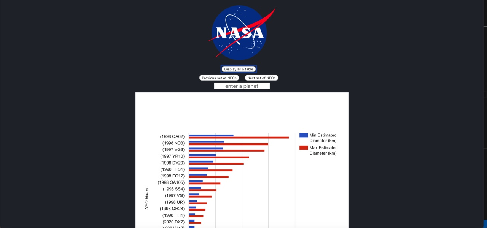
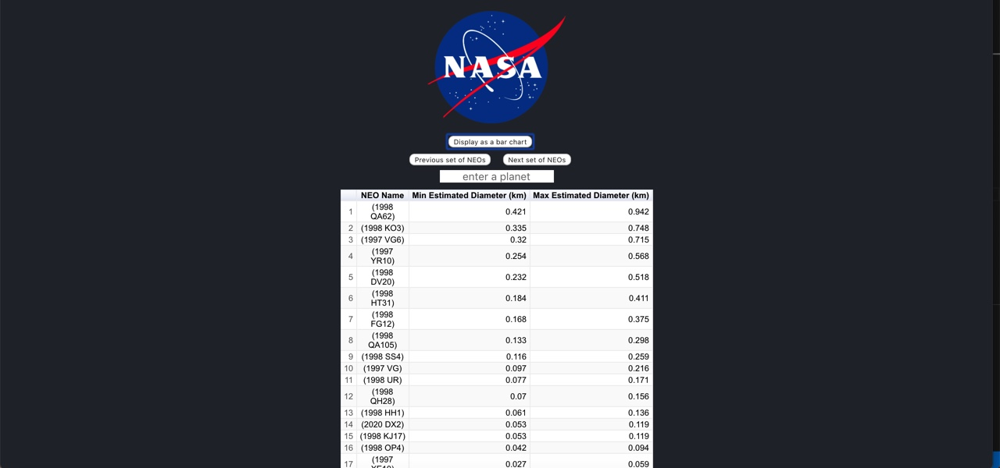
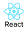
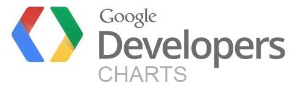
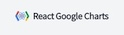

    

<h1 align="center">
  NEO-Data-Visualization
</h1>

Welcome to NEO-Data-Visualization 🌍🌌😎

The web-app NEO-Data-Visualization is a single page react application which gives you a better understanding of Near Earth Objects (NEO). Through two types of data visualization - bar chart and a table - this app gives you a better idea of NEO size and orbiting body. As an extra feature, you can paginate through the NEO data to see any of the thousands of NEO's out there in the solar system.
Enjoy your journey through Near Earth Objects 🌍🌌🔭

## This app uses :

1.  **React** 

2.  **TypeScript** 

3.  **Google Charts** 

4.  **React Google Charts** 

The project uses a starting point of [Create React App](https://create-react-app.dev/). Typescript has been added for type safety and improved developer experience. Finally, [React Google Charts](https://react-google-charts.com/) was used to supply the React and Typescript bindings for Google Charts. The project uses React hooks (specifically, `useState` for component state and `useEffect` to make API calls to the NASA NEO API via javascript's `fetch`).

The codebase is organised into three simple components, `BarChart`, `Table` and `Dropdown`.
`BarChart` displays the selected NEO data using the bar chart of [Google Charts](https://developers.google.com/chart/interactive/docs/gallery/barchart). It takes `neoData` and `selectedPlanet` as props.
`Table` displays the selected NEO data in the [Google Charts Table format](https://developers.google.com/chart/interactive/docs/gallery/table). It takes the same props as the `BarChart` component.
`Dropdown` is a clickable un-ordered list which displays and makes selectable the potential orbiting bodies. It takes `neoData` and `setSelectedPlanet` as props.

All types for the app are organised under the `types.tsx` file in the `src` folder.

## Get started 🚀🚀

To run this project locally :

### `npm install`

### `npm start`

To run a production build :

### `npm run build`
